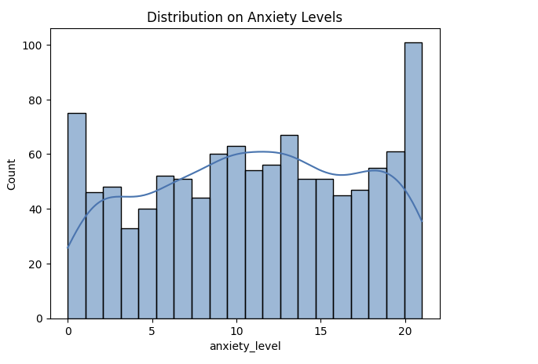
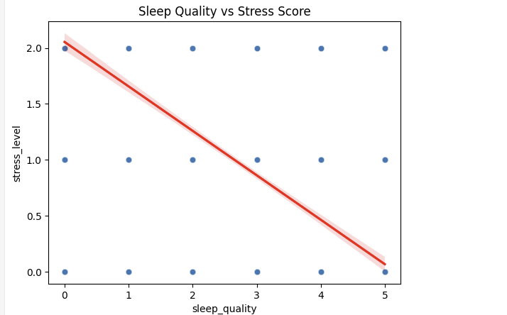
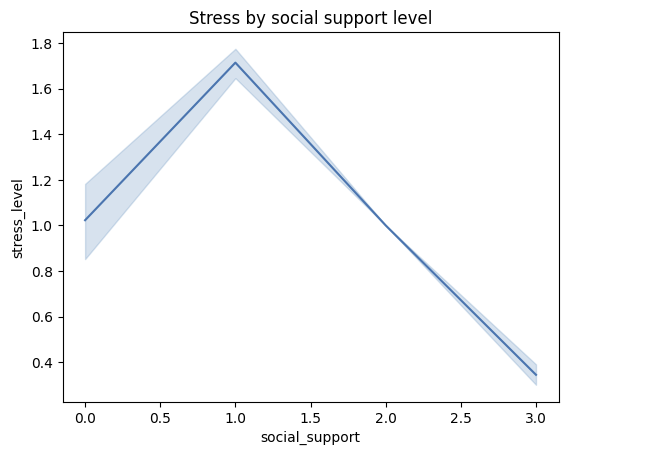
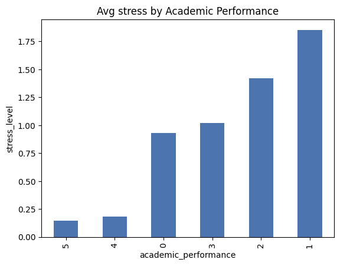
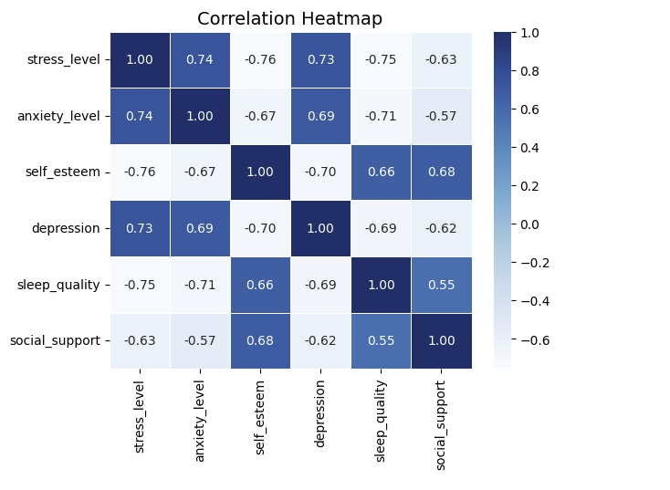

# Exploratory Data Analysis on Student Stress Levels Dataset

##  Project Overview
This project explores the Student Stress Monitoring Dataset from Kaggle to understand how psychological, lifestyle, academic, and social factors influence stress among students.  
The analysis uses Python (Pandas, Seaborn, Matplotlib) to perform data cleaning, exploratory data analysis (EDA), and visualization.  

Goal: Identify the strongest factors linked with student stress to highlight potential intervention points.  

---

##  Dataset
- Source: [Kaggle – Student Stress Monitoring](https://www.kaggle.com/datasets/mdsultanulislamovi/student-stress-monitoring-datasets)  
- Shape: 1,100 rows × 21 features  
- Features include:
  - `anxiety_level`, `self_esteem`, `depression`, `mental_health_history`
  - `sleep_quality`, `study_load`, `academic_performance`
  - `social_support`, `peer_pressure`, `bullying`
  - `stress_level` (target variable)

---

## Methods
1. Univariate Analysis
   - Histograms of psychological & lifestyle factors  
2. Bivariate Analysis
   - Sleep quality vs Stress  
   - Social support vs Stress  
   - Academic performance vs Stress  
3. Correlation Analysis 
   - Heatmap of psychological, academic, and social variables  

---

##  Key Insights
--Students with better sleep quality report much lower stress levels.  
-- Students with strong social support have stress scores nearly 50% lower than those with weak support.  
--Students with low academic performance report the highest stress levels.  
--Anxiety and depression are strongly positively correlated with stress.  

---
VISUALS:
##Anxiety Levels

## Sleep vs Stress

## Social Support vs Stress

## Academic Performance vs Stress

##Correlation 

---

## Tools & Libraries
- Python 3.9+
- Pandas, NumPy
- Matplotlib, Seaborn

---

##  Next Steps
- Apply **statistical tests** (t-tests/ANOVA) to validate relationships  
- Build a **predictive model** (e.g., logistic regression for high stress vs low stress)  
- Explore **feature importance** using tree-based models  

---

##  Author
Created by Sanjana Kailasanathan  to explore data-driven insights into student well-being.  
